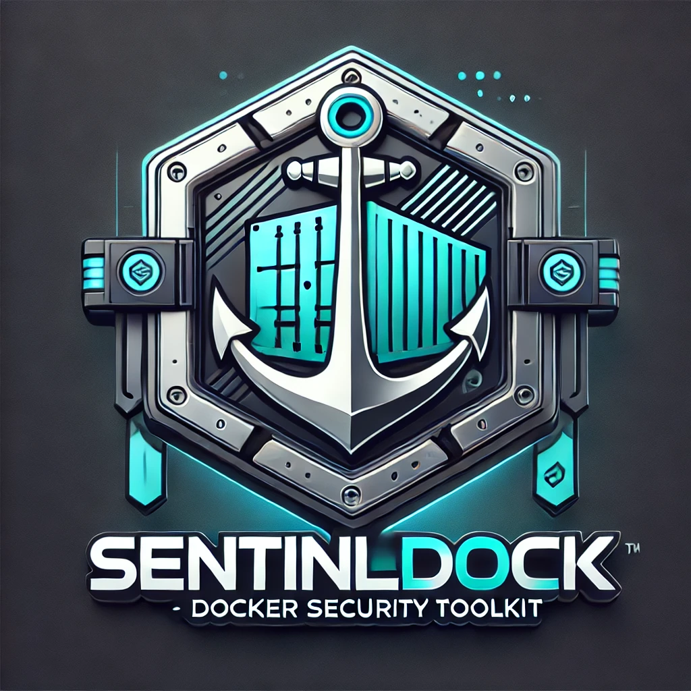
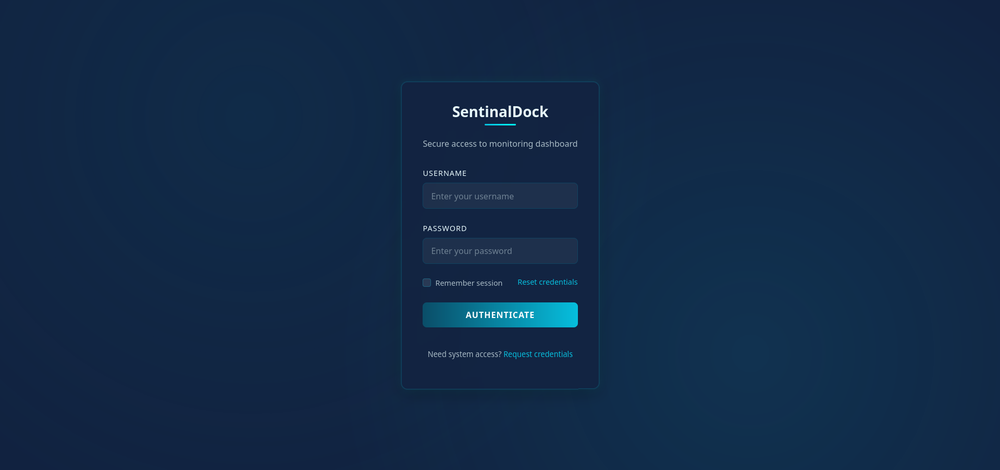
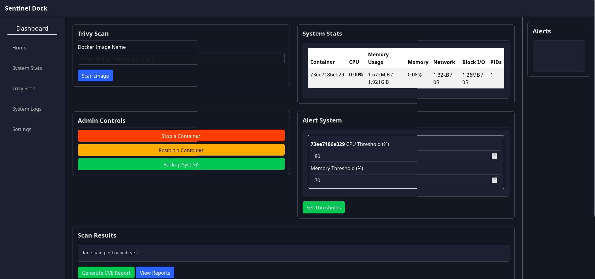
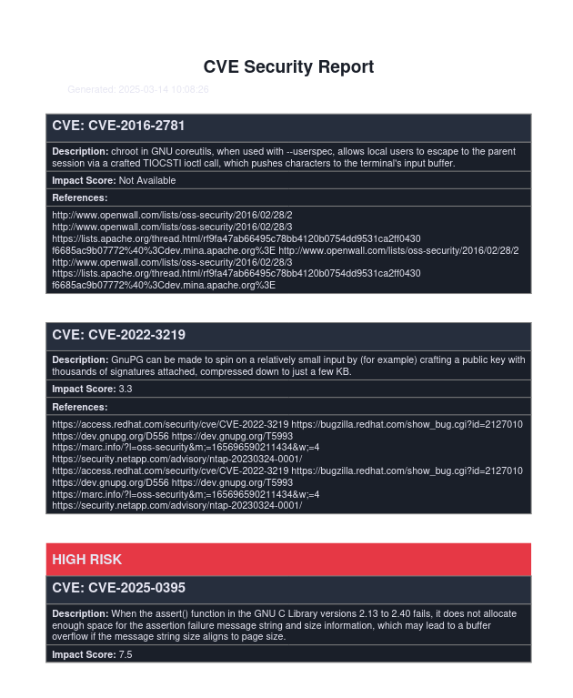

## Sentinel Dock 🚀  

A **powerful container security toolkit** designed to **secure Docker environments** with real-time monitoring, vulnerability scanning, and container security enhancements.

---

### 🔥 Features

✅ **Vulnerability Scanning with Trivy** - Scan Docker images and detect Common Vulnerabilities and Exposures (CVEs).  
✅ **Real-time Monitoring** - Track Docker container metrics like CPU and memory usage via an intuitive dashboard.  
✅ **Container Escape Detection** - Get alerts on potential container breakout attempts.  
✅ **Configuration Hardening** - Secure your Docker environment with best-practice recommendations.  
✅ **PDF Report Generation** - Generate detailed security reports with mitigation insights from the NVD.  
✅ **Interactive HTML Dashboard** - View security scan results and system metrics on a user-friendly web interface.





---

## 🚀 Installation Guide

### 🔗 Prerequisites

- **Docker** 🐳 installed and running.
- **Python 3.x** 🐍 installed.
- **Trivy** installed for vulnerability scanning.

### 📌 Setup Instructions

1️⃣ **Clone the repository**
```bash
git clone https://github.com/<your-username>/sentinel-dock.git
cd sentinel-dock
```

2️⃣ **Set up a virtual environment**
```bash
python3 -m venv venv
source venv/bin/activate  # Windows: venv\Scripts\activate
pip install -r requirements.txt
```

3️⃣ **Install Trivy**
```bash
# macOS
brew install aquasecurity/trivy/trivy

# Ubuntu
sudo apt-get install trivy
```

4️⃣ **Run Sentinel Dock**
```bash
python app.py
```
📌 Now visit **[http://localhost:5000](http://localhost:5000)** to access the dashboard.

---

## 📊 Viewing Metrics & Reports

- **Real-time Monitoring:** Navigate to the **Dashboard** to track live container stats.
- **Security Reports:** View and download detailed PDF reports containing vulnerability data and mitigation strategies.



---

## 🛠️ Roadmap

✅ **Database Integration** - Store scan results & system metrics for historical analysis.  
✅ **Expanded Reporting** - Customize and schedule security reports.  
✅ **Container Orchestration** - Add support for Kubernetes for enterprise-scale security.

---

## 🤝 Contributing

We welcome contributions! Follow these steps:

1️⃣ **Fork the repo**  
2️⃣ **Create a feature branch** (`git checkout -b feature-name`)  
3️⃣ **Commit changes** (`git commit -m 'Added a new feature'`)  
4️⃣ **Push to GitHub** (`git push origin feature-name`)  
5️⃣ **Submit a Pull Request** 🎉  

---

## 📜 License

Sentinel Dock is **open-source** and licensed under **Apache 2.0**. Check the [LICENSE](LICENSE) file for details.

---

## 🎖️ Acknowledgements

- **[Trivy](https://aquasecurity.github.io/trivy/)** - Vulnerability scanning for Docker containers.
- **[Flask](https://flask.palletsprojects.com/)** - Web framework for the frontend.
- **[Docker](https://www.docker.com/)** - Containerization platform.

🚀 **Secure your containers today with Sentinel Dock!** 🛡️

